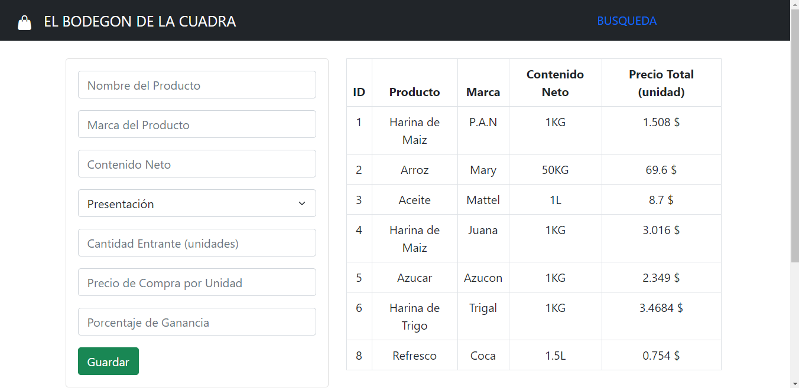
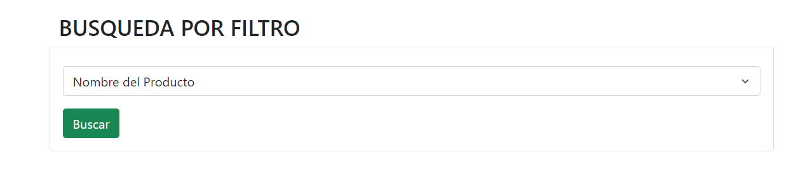
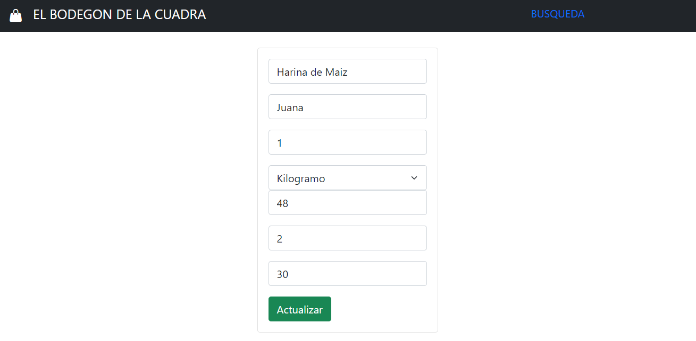
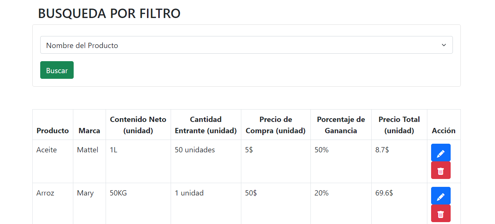
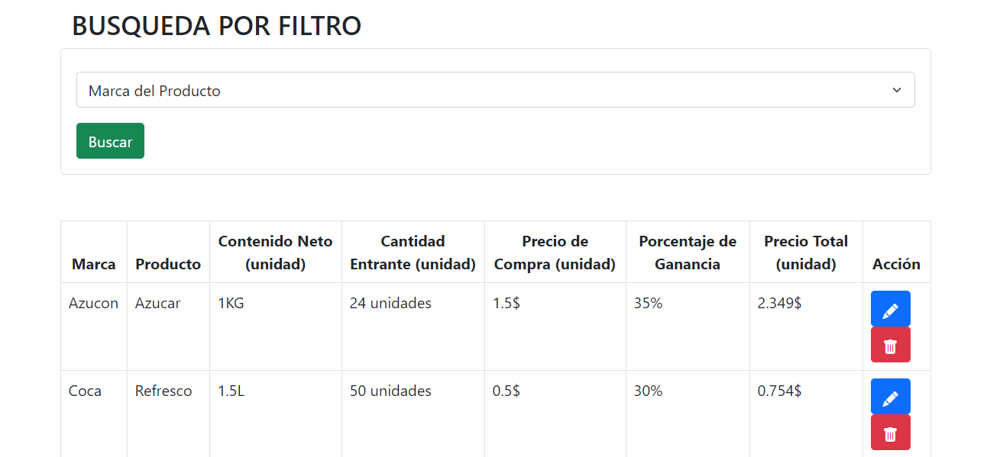
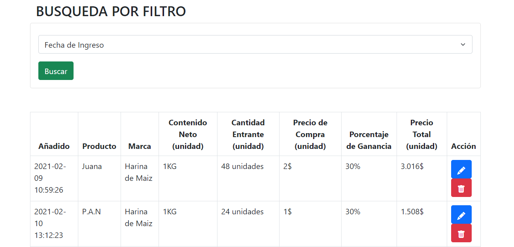

# PHP Y MYSQL (Parcial III)

Aplicacion creada a partir de una asignacion de la materia Laboratorio de Datos de la universidad.

## Asignación/problema

Realice un programa que por medio de un formulario web tome los datos de un inventario, los almacene en una base de datos MySQL.

Datos a pedir:

- Nombre del producto.
- Marca del producto.
- Tamaño del prodcuto (empaquetado).
- Cantidad del producto entrante.
- Precio de compra del producto.
- Porcentaje de ganancia del producto.
- Fecha de ingreso del producto (automatica).

Presentar una tabla donde se muestren los datos de los productos y calcule el precio final de venta, que sera: precio de compra + % de ganancia + IVA (16%).

La tabla debe permitir filtrar la busqueda por:

- Nombre de producto.
- Marca del producto.
- Fecha de ingreso.

## Página principal



## Página secundaria



## Página para editar



## Filtrado por nombre de producto



## Filtrado por marca de producto



## Filtrado por fecha



## Requerimientos

- [xampp](https://www.apachefriends.org/es/download.html#)
- [git](https://git-scm.com)

## Uso

En el archivo includes/config.php esta la configuracion de las variables globales, puedes editarlo con la configuracion de tu sistema.

Puedes cambiar los siguientes valores:

1. El puerto de la instancia de mysql
2. Usuario de mysql
3. Clave del usuario

### Ejemplo

```markdown
$host = 'localhost:8111';    
$usuario = 'root';           
$clave = '';
```

En la carpeta database estan los scripts para la creación de las bases de datos sql.

Solo tienes que insertar el archivo sql en el manejador de base de datos de tu preferencia para crear la base de datos.
Para tener la app activa solo tienes que agregar la carpeta del proyecto a la carpeta de xampp llamada htdocs e ir a localhost/php_mysql_parcial

```markdown
1. Clonar proyecto en la carpeta htdocs  

cd %USERPROFILE%\xampp\htdocs 
git clone https://github.com/gabrielba15/php_mysql_parcial.git 
 

2. Crea la base de datos si no la haz creado aun en el archivo (scripts.sql).

3. Cambia los valores de config.php

4. Ve a localhost/php_mysql_parcial en tu navegador.

5. Listo, happy hacking crack :D
```
